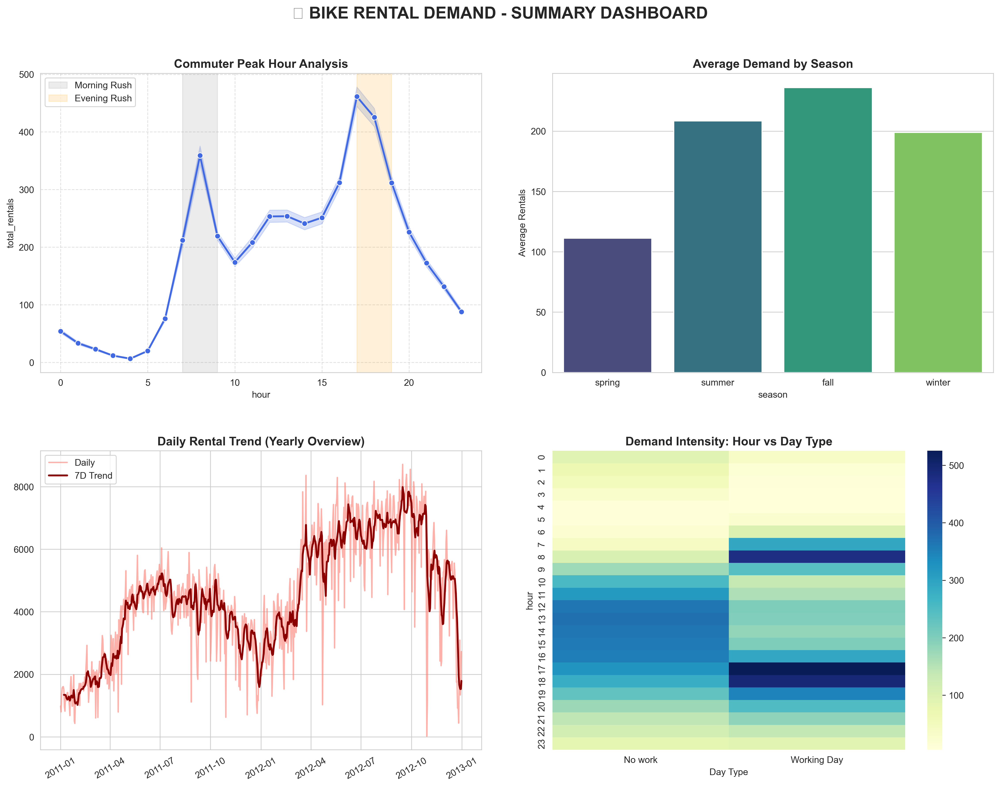

# 🚲 Bike Rental Demand Forecasting Analysis

## 📌 Project Overview
This project presents a comprehensive **Exploratory Data Analysis (EDA)** on bike rental demand using a dataset of 17,379 records. The goal is to identify how various factors—such as weather, time of day, and season—influence bike rental behavior. These insights are crucial for urban planning and optimizing bike-sharing operations.

## 🎯 Problem Definition
Urban mobility systems must ensure bike availability at the right time and location. Mismanagement leads to shortages or underutilization.
This project aims to:
- Identify peak demand patterns
- Understand the impact of weather and seasonality
- Build a forecasting model to predict rental demand

## 📊 Key Findings & Summary Dashboard
Our analysis culminated in a **Summary Dashboard** that highlights the most critical patterns in the data.

### 🚀 Major Insights:
1. **Commuting Powerhouse**
   - Rentals increase significantly during 7–9 AM and 5–7 PM, indicating strong commuter usage (peak demand ~2–3x higher than off-hours).
2. **Seasonal Impact**
   - Demand peaks in Summer and Fall, while Winter shows a sharp decline (~40–60%), highlighting temperature sensitivity.
3. **Weather Sensitivity**
   - Rentals are highest during clear/misty conditions. Demand drops drastically (~50%+) during rain/snow, confirming weather dependency.
4. **Workday vs Weekend Patterns**
   - Workdays → sharp commute peaks
   - Weekends → smooth afternoon peak (leisure-driven demand)

## 📂 Project Structure
- `Bike Rental Demand Forecasting.ipynb` → Full analysis & modeling
- `Dataset/Dataset.csv` → Raw dataset
- `summary_dashboard.png` → Final dashboard

---
## 👤 Author

Developed with ❤️ by **Omkar Gutal**

